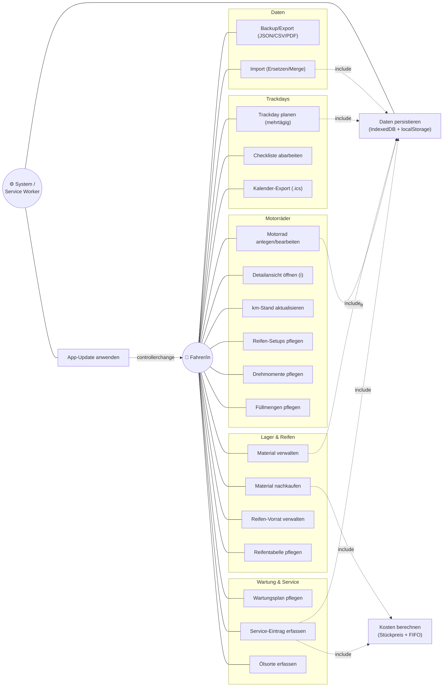
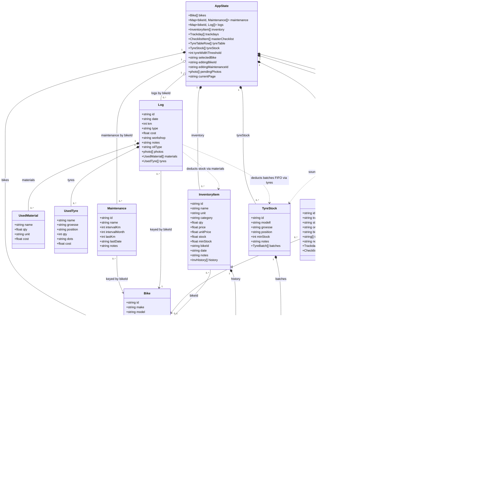
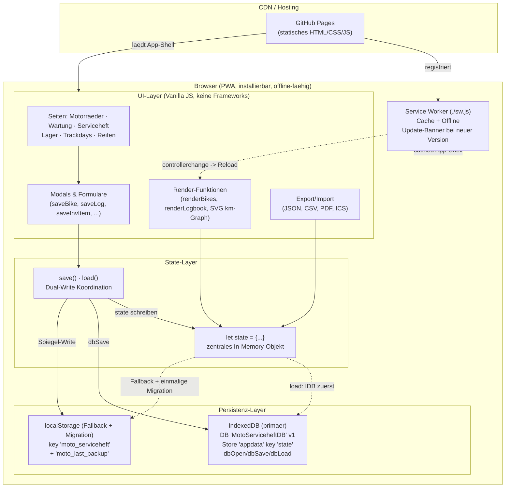
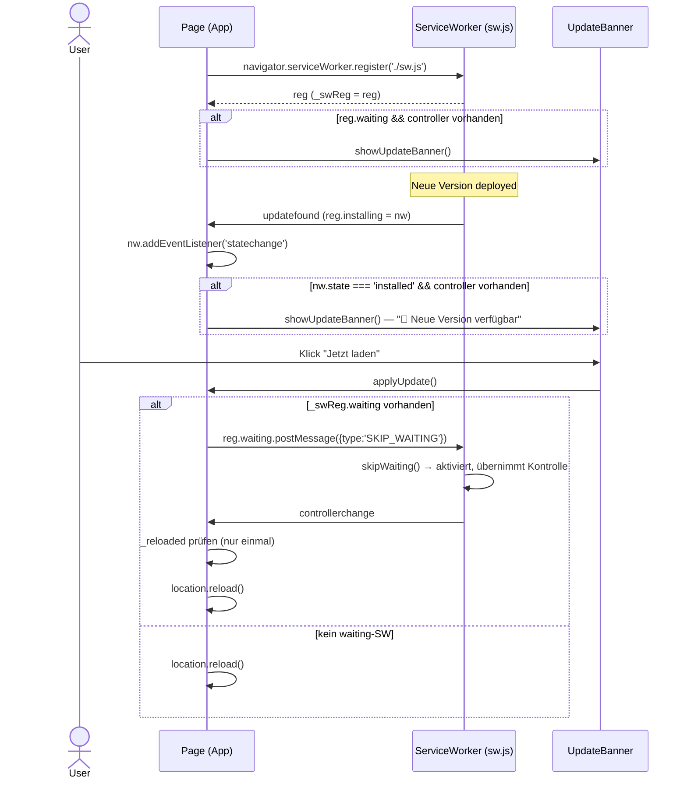

# BikerDesk — Detail-Design (UML)

**Stand:** App-Version v53 · September 2026
**Quelle:** abgeleitet aus dem echten Code (`index.html`, main, v53)
**Notation:** Mermaid (rendert in VS Code, GitHub, den meisten Markdown-Viewern)

BikerDesk ist eine Single-File Vanilla-HTML/CSS/JS-PWA mit einem zentralen In-Memory
`state`-Objekt, das per IndexedDB (primär) und localStorage (Fallback) persistiert wird.
Kein Framework, kein Backend — Hosting über GitHub Pages, Offline-Fähigkeit über einen
Service Worker.

---

## 1. Anwendungsfälle (Use-Case-Sicht)

Akteure: **Fahrer/in** (einziger menschlicher Nutzer) und **System / Service Worker**
(technischer Akteur für Persistenz und Update). Mermaid kennt kein natives
UML-Use-Case-Diagramm — hier als gruppiertes Diagramm mit `include`-Beziehungen für
die wiederkehrenden Kernabläufe (Persistenz, Kostenberechnung).



---

## 2. Statische Sicht

### 2.1 Datenmodell (Klassendiagramm)

Das zentrale `state`-Objekt und alle Entitäten mit ihren tatsächlich im Code
erzeugten/gespeicherten Feldern (inkl. abgeleiteter Felder wie `kmDate`, `unitPrice`).



### 2.2 Komponentensicht



> Hinweis: `sw.js` wird per `navigator.serviceWorker.register('./sw.js')` eingebunden,
> liegt aber nicht im selben Repo-Verzeichnis wie `index.html` — die Cache-Details sind
> aus dem Registrierungscode abgeleitet.

---

## 3. Dynamische Sicht

### 3.1 Service-Eintrag speichern mit Material- und Reifenverbrauch (`saveLog()`)

```mermaid
sequenceDiagram
    actor User
    participant UI as UI (Log-Modal)
    participant saveLog
    participant invUnitPrice
    participant tyreConsume
    participant State as state (memory)
    participant IDB as IndexedDB
    participant LS as localStorage

    User->>UI: Material wählen (onLogMaterialSelect)
    UI->>invUnitPrice: Stückpreis für inv
    invUnitPrice-->>UI: unitPrice (bzw. 0)
    User->>UI: Reifen aus Vorrat wählen (logTyres)
    UI->>UI: updateLogCostPreview()
    Note over UI: Live-Vorschau: matCost + tyreCost + manuelle Kosten<br/>⚠️ "kein Preis" bei unitPrice<=0

    User->>UI: 💾 Speichern
    UI->>saveLog: saveLog()
    saveLog->>saveLog: Pflichtfelder prüfen (date, km, type)
    alt Felder fehlen
        saveLog-->>User: Toast "Datum, km und Wartungsart sind Pflicht"
    else gültig
        loop je gewähltes Material
            saveLog->>invUnitPrice: invUnitPrice(inv)
            invUnitPrice-->>saveLog: unitPrice
            saveLog->>saveLog: materialCost += unitPrice * qty
            saveLog->>State: inv.stock = max(0, stock - qty)
            saveLog->>State: inv.history.push({type:'Verbrauch', qty, date, ref})
        end
        loop je gewählter Reifen
            saveLog->>tyreConsume: tyreConsume(t, qty)
            Note over tyreConsume: FIFO über t.batches (älteste DOT zuerst)
            tyreConsume->>State: batch.qty -= take; leere Chargen entfernen
            tyreConsume-->>saveLog: {taken, cost, dots}
            saveLog->>saveLog: tyreCost += cost
        end
        saveLog->>saveLog: totalCost = manuelleKosten + materialCost + tyreCost
        saveLog->>State: log{...} erzeugen, logs[bike].unshift(log)
        saveLog->>State: bike.km / kmDate / kmHistory aktualisieren (falls km höher)
        saveLog->>saveLog: save()
        saveLog->>IDB: dbSave() (primär)
        saveLog->>LS: localStorage.setItem (Fallback)
        saveLog->>UI: closeLogModal(); renderStats(); renderLogbook()
        saveLog-->>User: Toast "✅ Eintrag gespeichert (+X € Material/Reifen)"
    end
```

### 3.2 JSON Merge-Import (`importJSON()`, mode='merge')

```mermaid
sequenceDiagram
    actor User
    participant UI as UI (Daten-Modal)
    participant importJSON
    participant normStr
    participant State as state (memory)
    participant IDB as IndexedDB
    participant LS as localStorage

    User->>UI: Datei wählen (Modus = Merge)
    UI->>importJSON: importJSON(event)
    importJSON->>importJSON: FileReader.readAsText → JSON.parse
    alt data.bikes fehlt / kein Array
        importJSON-->>User: Toast "Ungültige Datei"
    else Merge-Modus
        Note over importJSON,normStr: normStr(s) = lowercase, ohne Leer-/Bindestriche

        loop je Bike mit torqueSpecs
            importJSON->>normStr: Ziel-Bike per id, sonst make+model
            importJSON->>State: torqueSpecs nur ergänzen wenn Ziel keine hat (torqueAdded++)
        end

        loop je Bike mit oilFilter/coolant
            importJSON->>normStr: Ziel-Bike per id, sonst make+model
            importJSON->>State: Füllmengen nur in leere Felder setzen (fillAdded++)
        end

        loop je Bike
            importJSON->>normStr: exists? per id ODER make+model
            alt nicht vorhanden
                importJSON->>State: bikes.push(b); maintenance/logs anlegen (added++)
            end
        end

        loop je Trackday
            importJSON->>State: push wenn id fehlt (tdAdded++)
        end
        loop je Inventory-Item
            importJSON->>State: push wenn id fehlt (invAdded++)
        end
        loop je tyreStock
            importJSON->>State: push wenn id fehlt
        end
        importJSON->>State: masterChecklist / tyreTable nur wenn noch leer

        importJSON-->>User: Toast "✅ ... hinzugefügt" (bzw. "Nichts Neues")
        importJSON->>importJSON: save()
        importJSON->>IDB: dbSave()
        importJSON->>LS: localStorage.setItem
        importJSON->>UI: renderBikes / renderTrackdays / renderInventory ...
    end
```

### 3.3 App-Update via Service Worker



### 3.4 Trackday-Status (Zustandsdiagramm)

```mermaid
stateDiagram-v2
    [*] --> Geplant : Trackday anlegen
    Geplant --> Gebucht : buchen
    Geplant --> Storniert : absagen
    Gebucht --> Erledigt : Termin gefahren
    Gebucht --> Storniert : absagen
    Geplant --> Erledigt : direkt abhaken

    state Erledigt {
        note as N1
            Detail-View read-only:
            Edit- und Checklist-Buttons ausgeblendet
        end note
    }
    state Storniert {
        note as N2
            Detail-View read-only:
            Edit- und Checklist-Buttons ausgeblendet
        end note
    }

    Erledigt --> [*]
    Storniert --> [*]
```

---

## Anmerkungen

- Die Feldlisten stammen aus den `save*`-Funktionen (nicht nur aus den Formularen),
  inkl. abgeleiteter Felder (`kmDate`, `unitPrice`).
- `logs` und `maintenance` sind im `state` nach `bikeId` verschlüsselt
  (`state.logs[bikeId] = [...]`), daher als assoziative Beziehung modelliert.
- Der **feste Stückpreis** (`unitPrice`) macht die Kostenrechnung robust gegenüber
  wechselnder Bedeutung von `qty` (Kaufmenge vs. aktueller Bestand nach Nachkauf).
- Reifenverbrauch nutzt **FIFO** über `batches` (älteste DOT zuerst).
